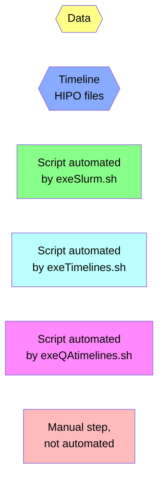
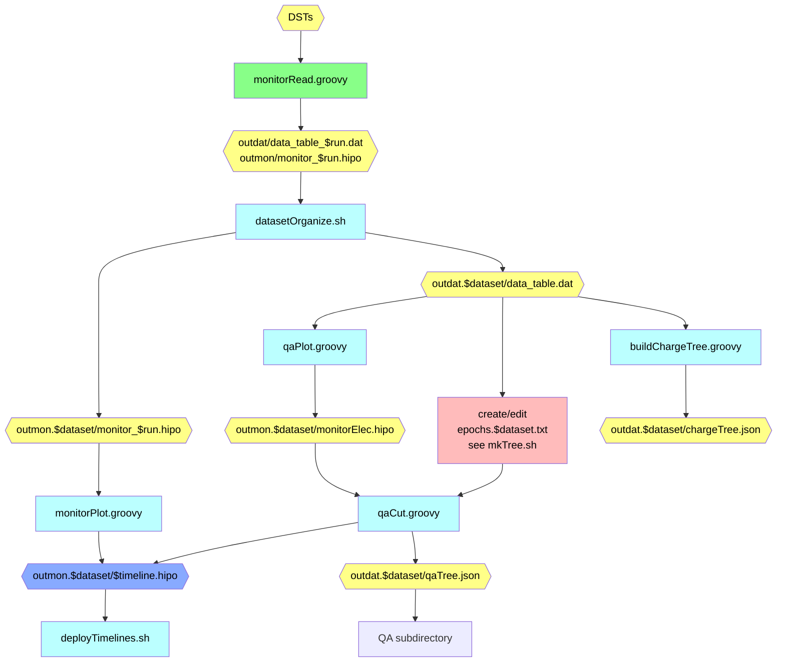
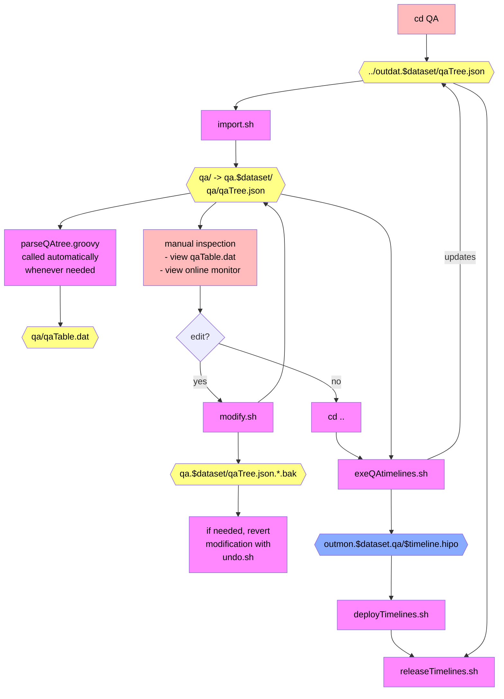

# QA Timeline Production Flowchart

## Legend

## Automatic QA Procedure

# Manual QA
### Note: `cd` to the `QA` subdirectory
- all scripts are run manually here (except `parseQAtree.groovy`, which runs automatically)

